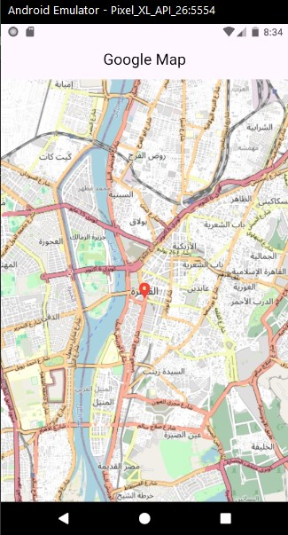

# Flutter Map App

A simple Flutter application that displays a map centered with a marker on Cairo, Egypt using the `flutter_map` package.

## Features

- **Map Display:** Uses OpenStreetMap tiles to render the map.
- **Location Marker:** Displays a red location pin at Cairo, Egypt.
- **Zoom Control:** Supports zooming in and out.

## Prerequisites

- [Flutter](https://flutter.dev) installed on your machine.
- A device or emulator running Android or iOS.

## Screenshots  
### Cairo 


## Getting Started

### 1. Clone the Repository

```bash
git clone https://github.com/YamatoEG/Simple_App.git

git checkout google_map
```

### 2. Install Dependencies

```bash
flutter pub get
```

### 3. Run the App

```bash
flutter run
```

## Dependencies

This project uses the following dependencies:

- `flutter`
- `flutter_map`
- `latlong2`


