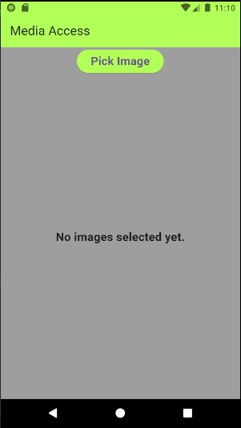
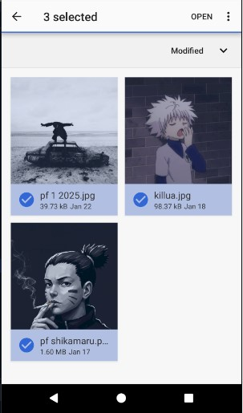
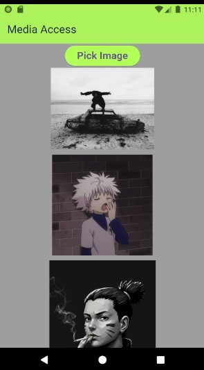

# Media Access App  

A simple Flutter application that demonstrates how to:  
- Pick multiple images from the device's gallery.  
- Display selected images in a scrollable ListView.  

## Features  

- **Image Picking:** Allows users to select multiple images from their device’s gallery.  
- **Image Display:** Shows selected images in a scrollable ListView.  
- **Responsive UI:** Adapts to different device screen sizes.  
- **No Images Handling:** Displays a message when no images have been selected.  
## Screenshots  
### Media Access Page  
 |  | 

## Prerequisites  

- [Flutter](https://flutter.dev) installed on your machine.  
- A device or emulator running Android or iOS.  

## Getting Started  

### 1. Clone the Repository  

```bash  
git clone https://github.com/YamatoEG/Simple_App.git

git checkout media_access
```  

### 2. Install dependencies  

```bash  
flutter pub get
```  

### 3. Run the App  

```bash  
flutter run
```

## Dependencies
This project uses the following dependencies:

- flutter
- image_picker