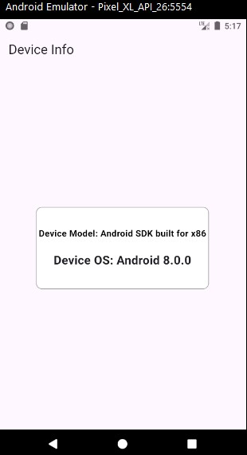

# Device Info App

A simple Flutter application that demonstrates how to:
- Fetch and display the device model and operating system information.
- Use the `device_info_plus` package to retrieve device details.

## Features

- **Device Info Fetching:** Automatically retrieves the device model and OS version.
- **Platform Detection:** Supports both Android and iOS devices.
- **Error Handling:** Displays an error message if the device info cannot be retrieved.

## Screenshots
### Device Info Page


## Prerequisites

- [Flutter](https://flutter.dev) installed on your machine.
- A device or emulator running Android or iOS.

## Getting Started

### 1. Clone the Repository

```bash
git clone https://github.com/YamatoEG/Simple_App.git

git chechout device_info
```

### 2. Install Dependencies

```bash
flutter pub get
```

### 3. Run the App

```bash
flutter run
```

## Dependencies

- This project uses the following dependencies:

 * flutter

 * device_info_plus

## Usage
- Launch the app on your Android or iOS device.

- The app will automatically fetch and display the device model and OS version.


## Error Handling
If the app encounters an error while fetching device info, it will display an error message in place of the device model and OS version.