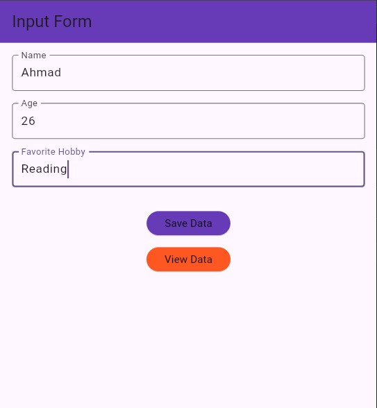
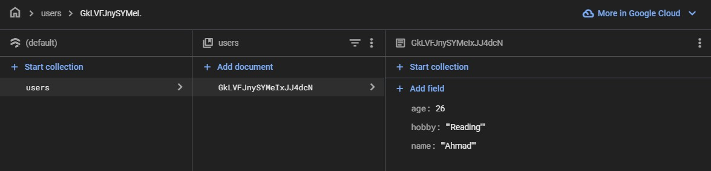

# Simple Firebase Firestore App

A simple Flutter application that demonstrates how to:
- Capture user input (Name, Age, and Favorite Hobby) using a form.
- Save the input data to Firebase Firestore.
- Retrieve and display the saved data on a separate page.

## Features

- **Input Form:** A form with three input fields for Name, Age, and Favorite Hobby.
- **Save Data:** Store user input in a Firestore collection named `users`.
- **View Data:** Navigate to a display page to fetch and show the stored data.
- **Firebase Integration:** Uses [Firebase Firestore](https://firebase.google.com/docs/firestore) for backend data storage.

## Screenshots
### Input Form Page


### Display Data Page


### Firebase Firestore Collection


## Prerequisites

- [Flutter](https://flutter.dev) installed on your machine.
- A Firebase project set up in the [Firebase Console](https://console.firebase.google.com).
- Firebase configuration files:
  - **Android:** Place `google-services.json` in the `android/app/` directory.
  - **iOS:** Place `GoogleService-Info.plist` in the `ios/Runner/` directory.

## Getting Started

### 1. Clone the Repository

```bash
git clone https://github.com/YamatoEG/Simple_App.git
```

### 2. Navigate to the Project Directory
```bash
cd Simple_App
```

### 3. Install Dependencies
```bash
flutter pub get
```

### 4. Run the Application
```bash
flutter run
```

## Firestore Rules (Ensure Read/Write Access)
Update your Firebase Firestore security rules to allow read/write access:
```json
rules_version = '2';
service cloud.firestore {
  match /databases/{database}/documents {
    match /users/{userId} {
      allow read, write: if true;
    }
  }
}
```

## Dependencies
This project uses the following dependencies:
- `flutter`
- `cloud_firestore`
- `firebase_core`
- `provider`


